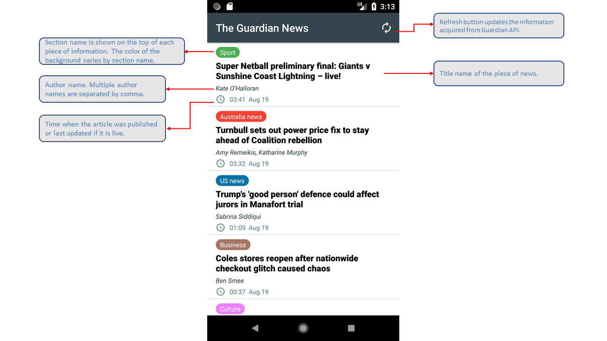

## News Feed App
#### Liang Sun                
#### August 18, 2018

### 1. Summary

The goal of this project is to create a News Feed app which gives a user regularly-updated news from the internet related to a particular topic, person, or location.

The projects involved connecting to the internet in Android, parsing responses from an API, updating the information in the app, and properly displaying that information:

- Connecting to an API
- Parsing the JSON response
- Handling error cases gracefully
- Updating information regularly
- Using an AsyncTask
- Doing network operations independent of the Activity lifecycle

To achieve the goal, this App uses the Guardian API. This is a well-maintained API which returns information in a JSON format.
https://open-platform.theguardian.com/documentation/

------

### 2. Work Plan

My work followed these steps:

1) Explore the Guardian API resources and learn the structure and content of the data. Identify the data that will be presented in the App.

2) Design the layout XML file, create a custom object and an ArrayAdapter for storing and displaying data.

3) Define the AsyncTask skeleton.

4) Define helper methods for quering the API.

5) Do JSON paring and store the information returned by the API in a custom class. Use the list and adpater pattern to populate a list of the information stored in the custom object wrote in step 2).

6) Switch to loader so that the App can save more of its resource while running.

7) Visual polishing.

------

### 3. User Interface

The completed App looks like this:



When clicking an item in the news list, the App leads to opening the news article in the browser.


------

### 4. XML files

#### news_activity.xml

```xml
<?xml version="1.0" encoding="utf-8"?>
<RelativeLayout
    xmlns:android="http://schemas.android.com/apk/res/android"
    android:layout_width="match_parent"
    android:layout_height="match_parent" >

    <ListView
        android:id="@+id/list"
        android:layout_width="match_parent"
        android:layout_height="match_parent"
        android:dividerHeight="@dimen/divider_height"
        android:orientation="vertical" />

    <TextView xmlns:android="http://schemas.android.com/apk/res/android"
        android:id="@+id/empty_view"
        android:layout_width="wrap_content"
        android:layout_height="wrap_content"
        android:layout_centerInParent="true"
        android:textAppearance="?android:textAppearanceMedium"/>

    <ProgressBar
        android:id="@+id/loading_spinner"
        style="@style/Widget.AppCompat.ProgressBar"
        android:layout_width="wrap_content"
        android:layout_height="wrap_content"
        android:layout_centerInParent="true"/>
</RelativeLayout>

```


#### list_item.xml

```xml
<?xml version="1.0" encoding="utf-8"?>
<LinearLayout xmlns:android="http://schemas.android.com/apk/res/android"
    xmlns:tools="http://schemas.android.com/tools"
    android:layout_width="match_parent"
    android:layout_height="wrap_content"
    android:background="@color/tan_background"
    android:orientation="vertical"
    android:paddingEnd="@dimen/padding_layout_parent"
    android:paddingLeft="@dimen/padding_layout_parent"
    android:paddingRight="@dimen/padding_layout_parent"
    android:paddingStart="@dimen/padding_layout_parent">

    <TextView
        android:id="@+id/section_name"
        android:layout_width="wrap_content"
        android:layout_height="wrap_content"
        android:layout_marginTop="@dimen/section_margin_top"
        android:background="@drawable/pillar_shape"
        android:paddingBottom="@dimen/section_padding_vertical"
        android:paddingEnd="@dimen/section_padding_horizontal"
        android:paddingStart="@dimen/section_padding_horizontal"
        android:paddingTop="@dimen/section_padding_vertical"
        android:textColor="@android:color/white"
        android:textSize="@dimen/text_size_nontitle"
        tools:backgroundTint="@android:color/holo_blue_bright"
        tools:text="@string/test_section" />

    <TextView
        android:id="@+id/news_title"
        android:layout_width="match_parent"
        android:layout_height="wrap_content"
        android:layout_marginTop="@dimen/title_author_margin_top"
        android:fontFamily="sans-serif-medium"
        android:textColor="@android:color/black"
        android:textSize="@dimen/text_size_title"
        android:textStyle="bold"
        tools:text="@string/test_title" />


    <TextView
        android:id="@+id/author_text"
        android:layout_width="wrap_content"
        android:layout_height="wrap_content"
        android:layout_marginTop="@dimen/title_author_margin_top"
        android:fontFamily="sans-serif"
        android:textStyle="italic"
        android:textColor="@color/colorPrimary"
        android:textSize="@dimen/text_size_nontitle"
        tools:text="@string/test_author" />

    <LinearLayout
        android:layout_width="match_parent"
        android:layout_height="wrap_content"
        android:orientation="horizontal"
        android:paddingBottom="@dimen/time_padding"
        android:paddingTop="@dimen/time_padding">

        <ImageView
            android:layout_width="@dimen/image_size"
            android:layout_height="@dimen/image_size"
            android:layout_marginRight="@dimen/image_margin"
            android:tint="@color/color_time"
            android:src="@drawable/clock" />

        <TextView
            android:id="@+id/news_time"
            android:layout_width="wrap_content"
            android:layout_height="match_parent"
            android:gravity="center_vertical"
            android:textColor="@color/color_time"
            android:textSize="@dimen/text_size_nontitle"
            tools:text="@string/test_time" />
    </LinearLayout>
</LinearLayout>
```


---

### 5. JAVA codes

#### News.java

```java
package com.example.android.newsfeedapp;

import java.util.List;

public class News {
    private String mTitle;
    private String mTime;
    private String mSectionName;
    private String mUrl;
    private List<String> mContributor;

    public News(String title,String time, String sectionName,String url,List<String> contributor){
        mTitle = title;
        mTime = time;
        mSectionName = sectionName;
        mUrl = url;
        mContributor = contributor;
    }

    public String getTitle(){return mTitle;}
    public String getTime(){return mTime;}
    public String getSectionName(){return mSectionName;}
    public String getUrl(){return mUrl;}
    public List<String> getContributor(){return mContributor;}
}
```


#### NewsAdapter.java

```java
package com.example.android.newsfeedapp;

import android.app.Activity;
import android.content.Context;
import android.graphics.drawable.GradientDrawable;
import android.support.v4.content.ContextCompat;
import android.view.LayoutInflater;
import android.view.View;
import android.view.ViewGroup;
import android.widget.ArrayAdapter;
import android.widget.ImageView;
import android.widget.TextView;

import java.text.DateFormat;
import java.text.ParseException;
import java.text.SimpleDateFormat;
import java.util.ArrayList;
import java.util.List;
import java.util.Date;
import java.util.stream.Collectors;

import butterknife.ButterKnife;
import butterknife.BindView;

public class NewsAdapter extends ArrayAdapter<News> {
    ViewHolder holder;

    public NewsAdapter(Activity context, ArrayList<News> news){
        super(context,0,news);
    }

    @Override
    public View getView(int position, View convertView, ViewGroup parent) {
        if (convertView == null) {
            convertView = LayoutInflater.from(getContext()).inflate(R.layout.list_item, parent, false);
            holder = new ViewHolder(convertView);
            convertView.setTag(holder);
        } else {
            holder = (ViewHolder) convertView.getTag();
        }

        News currentInfo = getItem(position);

        String title = currentInfo.getTitle();
        String time = currentInfo.getTime();
        String sectionName = currentInfo.getSectionName();

        String timePart1 = time.substring(0,10);

        String timePart2 = time.substring(11,16);


        String timeDisplayed = timePart2 + "  "+ formatDate(timePart1);

        holder.sectionTextView.setText(sectionName);
        holder.titleTextView.setText(title);
        holder.timeTextView.setText(timeDisplayed);

        List<String> authorList = currentInfo.getContributor();

        String authorText = "";


        if (authorList.size() > 0) {
            for (String s: authorList){
                authorText += s + ", ";
            }
            int len = authorText.length();
            String newText = authorText.substring(0,len-2);
            holder.authorTextView.setText(newText);
        }
        else {
            holder.authorTextView.setVisibility(View.GONE);
        }


        int pillarColor = getSectionColor(sectionName);

        GradientDrawable pillarShape = (GradientDrawable) holder.sectionTextView.getBackground();
        pillarShape.setColor(pillarColor);

        return convertView;
    }


    static class ViewHolder{
        @BindView(R.id.section_name) TextView sectionTextView;
        @BindView(R.id.news_title) TextView titleTextView;
        @BindView(R.id.news_time) TextView timeTextView;
        @BindView(R.id.author_text) TextView authorTextView;

        public ViewHolder(View view) {
            ButterKnife.bind(this,view);
        }
    }


    private int getSectionColor(String sectionName){
        int sectionColorResourceId;
        switch (sectionName) {
            case "Football":
                sectionColorResourceId = R.color.football;
                break;
            case "Sport":
                sectionColorResourceId = R.color.sport;
                break;
            case "World news":
                sectionColorResourceId = R.color.world_news;
                break;
            case "Music":
                sectionColorResourceId = R.color.arts;
                break;
            case "Life and style":
                sectionColorResourceId = R.color.lifestyle;
                break;
            case "Stage":
                sectionColorResourceId = R.color.stage;
                break;
            case "Business":
                sectionColorResourceId = R.color.business;
                break;
            case "Fashion":
                sectionColorResourceId = R.color.fashion;
                break;
            case "Opinion":
                sectionColorResourceId = R.color.opinion;
                break;
            case "Film":
                sectionColorResourceId = R.color.film;
                break;
            case "Science":
                sectionColorResourceId = R.color.science;
                break;
            case "Law":
                sectionColorResourceId = R.color.law;
                break;
            case "Environment":
                sectionColorResourceId = R.color.environment;
                break;
            case "UK news":
                sectionColorResourceId = R.color.uk_news;
                break;
            case "US news":
                sectionColorResourceId = R.color.us_news;
                break;
            case "Education":
                sectionColorResourceId = R.color.education;
                break;
            case "Australia news":
                sectionColorResourceId = R.color.australia_news;
                break;
            case "Technology":
                sectionColorResourceId = R.color.technology;
                break;
            case "News":
                sectionColorResourceId = R.color.news;
                break;
            case "Society":
                sectionColorResourceId = R.color.society;
                break;
            case "Books":
                sectionColorResourceId = R.color.books;
                break;
            case "Politics":
                sectionColorResourceId = R.color.politics;
                break;
            case "Culture":
                sectionColorResourceId = R.color.culture;
                break;
            default:
                sectionColorResourceId = R.color.unassigned;
                break;
        }
        return ContextCompat.getColor(getContext(),sectionColorResourceId);
    }


    private String formatDate(String dateStr) {
        DateFormat inputFormat = new SimpleDateFormat("yyyy-MM-dd");
        DateFormat outputFormat = new SimpleDateFormat("MMM dd");
        Date date = null;
        try {
            date = inputFormat.parse(dateStr);
        } catch(ParseException e){
            e.printStackTrace();
        }
        String outputDate = outputFormat.format(date);
        return outputDate;
    }

}

```

#### NewsActivity.java

```java
package com.example.android.newsfeedapp;

import android.app.LoaderManager;
import android.app.LoaderManager.LoaderCallbacks;
import android.content.Context;
import android.content.Intent;
import android.content.Loader;
import android.net.ConnectivityManager;
import android.net.NetworkInfo;
import android.net.Uri;
import android.support.v7.app.AppCompatActivity;
import android.os.Bundle;
import android.util.Log;
import android.view.Menu;
import android.view.MenuItem;
import android.view.View;
import android.widget.AdapterView;
import android.widget.ListView;
import android.widget.TextView;
import android.widget.Toast;

import java.util.ArrayList;
import java.util.List;

public class NewsActivity extends AppCompatActivity implements LoaderCallbacks<List<News>> {

    private static final String LOG_TAG = NewsActivity.class.getSimpleName();

    private static final int NEWS_LOADER_ID = 0;

    private NewsAdapter mAdapter;

    private static final String REQUEST_URL = "https://content.guardianapis.com/search?show-tags=contributor";

    private TextView mEmptyStateTextView;


    @Override
    protected void onCreate(Bundle savedInstanceState) {
        super.onCreate(savedInstanceState);
        setContentView(R.layout.news_activity);

        ListView newsListView = (ListView) findViewById(R.id.list);

        mEmptyStateTextView = (TextView) findViewById(R.id.empty_view);
        newsListView.setEmptyView(mEmptyStateTextView);

        mAdapter = new NewsAdapter(this,new ArrayList<News>());

        newsListView.setAdapter(mAdapter);

        newsListView.setOnItemClickListener(new AdapterView.OnItemClickListener() {
            @Override
            public void onItemClick(AdapterView<?> parent, View view, int position, long id) {
                News currentNews = mAdapter.getItem(position);
                Uri newsUrl = Uri.parse(currentNews.getUrl());
                Intent websiteIntent = new Intent(Intent.ACTION_VIEW, newsUrl);
                startActivity(websiteIntent);
            }
        });

        ConnectivityManager connMgr = (ConnectivityManager) getSystemService(Context.CONNECTIVITY_SERVICE);
        NetworkInfo networkInfo = connMgr.getActiveNetworkInfo();

        if (networkInfo != null && networkInfo.isConnected()) {
            LoaderManager loaderManager = getLoaderManager();
            Log.i(LOG_TAG, "TEST: calling initLoader() ...");
            loaderManager.initLoader(NEWS_LOADER_ID, null, this);
        } else {
            View loading = findViewById(R.id.loading_spinner);
            loading.setVisibility(View.GONE);
            mEmptyStateTextView.setText(R.string.no_internet_connection);
        }
    }

    @Override
    public boolean onCreateOptionsMenu(Menu menu) {
        getMenuInflater().inflate(R.menu.refresh, menu);
        return super.onCreateOptionsMenu(menu);
    }

    @Override
    public boolean onOptionsItemSelected(MenuItem item) {
        switch (item.getItemId()) {
            case R.id.action_refresh:
                Toast.makeText(this, "Refresh selected", Toast.LENGTH_SHORT)
                        .show();
                Intent refresh = new Intent(this,NewsActivity.class);
                startActivity(refresh);
                this.finish();
                return true;
            default:
                return super.onOptionsItemSelected(item);
        }
    }


    @Override
    public Loader<List<News>> onCreateLoader(int id, Bundle args) {
        Log.i(LOG_TAG, "TEST: onCreateLoader() called");
        return new NewsLoader(this, REQUEST_URL);
    }

    @Override
    public void onLoadFinished(Loader<List<News>> loader, List<News> news) {
        Log.i(LOG_TAG, "TEST: onLoadFinished() called");
        View loading = findViewById(R.id.loading_spinner);
        loading.setVisibility(View.GONE);

        mEmptyStateTextView.setText(R.string.no_news);
        mAdapter.clear();
        if (news != null && !news.isEmpty()) {
            mAdapter.addAll(news);
        }
    }

    @Override
    public void onLoaderReset(Loader<List<News>> loader) {
        Log.i(LOG_TAG, "TEST: onLoaderReset() called");
        mAdapter.clear();
    }
}

```

#### NewsLoader.java
```java
package com.example.android.newsfeedapp;

import android.content.AsyncTaskLoader;
import android.content.Context;
import android.util.Log;

import java.util.ArrayList;
import java.util.List;

public class NewsLoader extends AsyncTaskLoader<List<News>> {

    private static final String LOG_TAG = NewsLoader.class.getName();

    private String mUrl;

    public NewsLoader(Context context, String url) {
        super(context);
        mUrl = url;
    }

    @Override
    protected void onStartLoading() {
        Log.i(LOG_TAG, "Test: onStartLoading() called");
        forceLoad();
    }

    @Override
    public List<News> loadInBackground() {
        Log.i(LOG_TAG, "Test: loadInBackground() called");
        if (mUrl == null) {
            return null;
        }

        List<News> news = Utils.fetchNewsData(mUrl);
        return news;
    }
}

```

### Utils.java

```java
package com.example.android.newsfeedapp;

import android.text.TextUtils;
import android.util.Log;

import org.json.JSONArray;
import org.json.JSONException;
import org.json.JSONObject;

import java.io.BufferedReader;
import java.io.IOException;
import java.io.InputStream;
import java.io.InputStreamReader;
import java.net.HttpURLConnection;
import java.net.MalformedURLException;
import java.net.URL;
import java.nio.charset.Charset;
import java.util.ArrayList;
import java.util.List;

public final class Utils {

    public static final String LOG_TAG = Utils.class.getSimpleName();

    public static List<News> fetchNewsData(String requestUrl) {
        URL url = createUrl(requestUrl);

        String jsonResponse = null;
        try {
            jsonResponse = makeHttpRequest(url);
        } catch (IOException e) {
            Log.e(LOG_TAG, "Error closing input stream", e);
        }

        List<News> news = extractNewsFromJson(jsonResponse);

        return news;
    }

    private static URL createUrl(String stringUrl) {
        URL url = null;
        try {
            url = new URL(stringUrl);
        } catch (MalformedURLException e) {
            Log.e(LOG_TAG, "Error with creating URL", e);
        }
        return url;
    }


    private static String makeHttpRequest(URL url) throws IOException {
        String jsonResponse = "";
        if (url == null) {
            return jsonResponse;
        }

        HttpURLConnection urlConnection = null;
        InputStream inputStream = null;
        try {
            urlConnection = (HttpURLConnection) url.openConnection();
            urlConnection.setRequestMethod("GET");
            urlConnection.setRequestProperty("api-key", "74a3a4b0-6cd4-4cf6-9564-aff69402363e");
            urlConnection.setReadTimeout(10000);
            urlConnection.setConnectTimeout(15000);
            urlConnection.connect();

            if (urlConnection.getResponseCode() == 200) {
                inputStream = urlConnection.getInputStream();
                jsonResponse = readFromStream(inputStream);
            } else {
                Log.e(LOG_TAG, "Error response code: " + urlConnection.getResponseCode());
            }
        } catch (IOException e) {
            Log.e(LOG_TAG, "Problem retrieving the earthquake JSON results.", e);
        } finally {
            if (urlConnection != null) {
                urlConnection.disconnect();
            }
            if (inputStream != null) {
                inputStream.close();
            }
        }
        return jsonResponse;
    }

    private static String readFromStream(InputStream inputStream) throws IOException {
        StringBuilder output = new StringBuilder();
        if (inputStream != null) {
            InputStreamReader inputStreamReader = new InputStreamReader(inputStream, Charset.forName("UTF-8"));
            BufferedReader reader = new BufferedReader(inputStreamReader);
            String line = reader.readLine();
            while (line != null) {
                output.append(line);
                line = reader.readLine();
            }
        }
        return output.toString();
    }

    private static List<News> extractNewsFromJson(String newsJSON) {
        List<News> news = new ArrayList<News>();

        if (TextUtils.isEmpty(newsJSON)) {
            return null;
        }

        try {
            JSONObject baseJsonResponse = new JSONObject(newsJSON);
            JSONObject responseJson = baseJsonResponse.getJSONObject("response");
            JSONArray resultsArray = responseJson.getJSONArray("results");

            for (int i = 0; i < resultsArray.length(); i++) {
                JSONObject c = resultsArray.getJSONObject(i);
                String title = c.getString("webTitle");
                String time = c.getString("webPublicationDate");
                String section = c.getString("sectionName");
                String url = c.getString("webUrl");

                JSONArray tagsArray = c.getJSONArray("tags");
                List<String> authorList = new ArrayList();
                if (tagsArray.length() > 0) {
                    for (int j = 0; j < tagsArray.length(); j++) {
                        JSONObject d = tagsArray.getJSONObject(j);
                        String contributor = d.getString("webTitle");
                        authorList.add(contributor);
                    }
                }

                news.add(new News(title, time, section, url, authorList));
            }
            return news;
        } catch (JSONException e) {
            Log.e(LOG_TAG, "Problem parsing the earthquake JSON results", e);
        }
        return null;
    }
}


```
---

### 6. Configurations

#### AndroidManifest.xml

- Remember to add permissions to AndroidManifest.xml when the app needs to acquire information from the internet.

```xml
<?xml version="1.0" encoding="utf-8"?>
<manifest xmlns:android="http://schemas.android.com/apk/res/android"
    package="com.example.android.newsfeedapp">

    <uses-permission android:name="android.permission.INTERNET"/>
    <uses-permission android:name="android.permission.ACCESS_NETWORK_STATE"/>

    <application
        android:allowBackup="true"
        android:icon="@mipmap/ic_launcher"
        android:label="@string/app_name"
        android:roundIcon="@mipmap/ic_launcher_round"
        android:supportsRtl="true"
        android:theme="@style/AppTheme">
        <activity android:name=".NewsActivity">
            <intent-filter>
                <action android:name="android.intent.action.MAIN" />

                <category android:name="android.intent.category.LAUNCHER" />
            </intent-filter>
        </activity>
        <meta-data
            android:name="preloaded_fonts"
            android:resource="@array/preloaded_fonts" />
    </application>

</manifest>

```

#### build.gradle (app)

- Need to add dependencies to the build.gradle file so that certain packages can work in the app.

```java

apply plugin: 'com.android.application'

android {
    compileSdkVersion 27
    defaultConfig {
        applicationId "com.example.android.newsfeedapp"
        minSdkVersion 16
        targetSdkVersion 27
        versionCode 1
        versionName "1.0"
        testInstrumentationRunner "android.support.test.runner.AndroidJUnitRunner"
    }
    buildTypes {
        release {
            minifyEnabled false
            proguardFiles getDefaultProguardFile('proguard-android.txt'), 'proguard-rules.pro'
        }
    }
}

dependencies {
    implementation fileTree(dir: 'libs', include: ['*.jar'])
    implementation 'com.android.support:appcompat-v7:27.1.1'
    implementation 'com.android.support.constraint:constraint-layout:1.1.2'
    implementation 'com.android.support:design:27.1.1'
    implementation 'com.android.support:support-v4:27.1.1'
    implementation 'com.jakewharton:butterknife:8.8.1'
    implementation 'com.android.support:recyclerview-v7:27.1.1'
    annotationProcessor 'com.jakewharton:butterknife-compiler:8.8.1'

    testImplementation 'junit:junit:4.12'
    androidTestImplementation 'com.android.support.test:runner:1.0.2'
    androidTestImplementation 'com.android.support.test.espresso:espresso-core:3.0.2'
}

```
